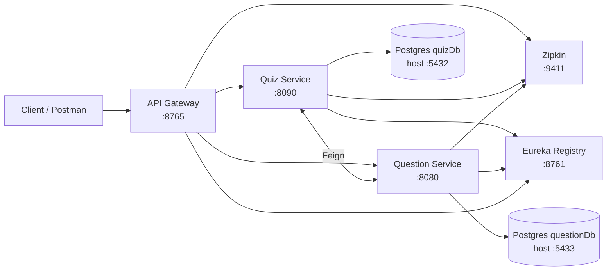

# Quiz Microservices (Spring Boot) — Production-style microservices

A Spring Boot microservices project that implements a **quiz platform** (quizzes + questions) with **service discovery, API gateway routing, fault-tolerance, distributed tracing, metrics, and Dockerized infrastructure**.

If you’re a recruiter/hiring manager, this repo is meant to demonstrate practical backend engineering skills:

- **Microservices architecture**: gateway + service registry + domain services
- **Inter-service communication**: Feign client between services
- **Resilience**: circuit breaker + fallbacks (Resilience4j)
- **Observability**: Actuator, Prometheus endpoint, Zipkin tracing, trace/span IDs in logs
- **DevOps readiness**: Dockerfiles + `docker-compose.yml` with healthchecks and dependencies

## Table of contents

- [Architecture](#architecture)
- [Services](#services)
- [Key features](#key-features)
- [Tech stack](#tech-stack)
- [Run it](#run-it)
- [API endpoints (sample)](#api-endpoints-sample)
- [Observability](#observability)
- [Project structure](#project-structure)
- [Troubleshooting](#troubleshooting)
- [More docs](#more-docs)

## 🏗️ Architecture



## Services

| Service | Port | Purpose |
|---|---:|---|
| `service-registry` | 8761 | Eureka server (service discovery) |
| `api-gateway` | 8765 | Single entrypoint + routing |
| `question-service` | 8080 | CRUD questions + scoring |
| `quiz-service` | 8090 | Create quizzes + submit answers |
| `zipkin` | 9411 | Distributed tracing UI |
| `postgres` | 5432 | DB for `quiz-service` (`quizDb`) |
| `postgres-question` | 5433 | DB for `question-service` (`questionDb`) |

## Key features

- **API Gateway + discovery-based routing**: route everything via a single entrypoint (`api-gateway`) while services register with Eureka.
- **Fault tolerance**: `quiz-service` calls `question-service` through Feign and is protected by Resilience4j (circuit breaker + fallback).
- **Observability end-to-end**:
  - Actuator health + metrics
  - `/actuator/prometheus` metrics endpoint
  - Zipkin distributed tracing
  - log correlation via trace/span IDs (Logback + MDC)
- **Dockerized dev environment**: `docker-compose.yml` orchestrates infra + services with healthchecks and startup ordering.

## 🛠️ Tech Stack

- **Java**: 21
- **Spring Boot**: 4.0.2
- **Spring Cloud**: 2025.1.x
- **Build**: Maven
- **Gateway**: Spring Cloud Gateway (WebMVC)
- **Service discovery**: Netflix Eureka
- **HTTP client**: OpenFeign
- **Resilience**: Resilience4j
- **Tracing**: Micrometer Tracing + Zipkin
- **Metrics/health**: Spring Boot Actuator + Prometheus endpoint
- **DB**: PostgreSQL 16
- **Containerization**: Docker + Docker Compose
- **Logging**: Logback (MDC: traceId/spanId)

## Prerequisites

- **Java 21** or higher
- **Maven 3.6+**
- **Docker** and **Docker Compose** (for containerized deployment)
- **PostgreSQL 16** (for local development without Docker)
- **Git**

## Run it

### Option A: Docker Compose (recommended)

From the repo root:

```bash
docker-compose up --build
```

Open:

- Eureka: `http://localhost:8761`
- Zipkin: `http://localhost:9411`
- API Gateway: `http://localhost:8765`

Stop:

```bash
docker-compose down
```

Clean slate (removes DB volumes):

```bash
docker-compose down -v
```

### Option B: Local run (no Docker)

You’ll need **two Postgres DBs** (`quizDb` on `5432`, `questionDb` on `5433`) and (optionally) Zipkin.

Create DBs:

```sql
CREATE DATABASE quizDb;
CREATE DATABASE questionDb;
```

Start Zipkin (optional but recommended):

```bash
docker run -d -p 9411:9411 openzipkin/zipkin
```

Start services in order:

```bash
cd service-registry
mvn spring-boot:run
```

```bash
cd question-service
mvn spring-boot:run
```

```bash
cd quiz-service
mvn spring-boot:run
```

```bash
cd api-gateway
mvn spring-boot:run
```

## API endpoints (sample)

### Quiz Service Endpoints

All endpoints are accessible through the API Gateway at `http://localhost:8765` or directly at `http://localhost:8090`

#### 1. Create Quiz
```http
POST /quiz/create
Content-Type: application/json

{
  "categoryName": "Java",
  "numOfQuestions": 10,
  "title": "Java Fundamentals Quiz"
}
```

**Response:**
```json
"Success"
```

#### 2. Get Quiz Questions
```http
GET /quiz/get/{id}
```

**Response:**
```json
[
  {
    "id": 1,
    "questionTitle": "What is Java?",
    "option1": "A programming language",
    "option2": "A coffee",
    "option3": "An island",
    "option4": "A framework"
  }
]
```

#### 3. Submit Quiz
```http
POST /quiz/submit/{id}
Content-Type: application/json

[
  {
    "id": 1,
    "response": "A programming language"
  },
  {
    "id": 2,
    "response": "Object-oriented"
  }
]
```

**Response:**
```json
8
```

### Question Service Endpoints

Accessible at `http://localhost:8080` or through API Gateway

#### 1. Get All Questions
```http
GET /question/all-questions
```

#### 2. Get Questions by Category
```http
GET /question/category/{category}
```

#### 3. Add Question
```http
POST /question/add
Content-Type: application/json

{
  "questionTitle": "What is Spring Boot?",
  "category": "Java",
  "option1": "A framework",
  "option2": "A language",
  "option3": "A database",
  "option4": "A server",
  "rightAnswer": "A framework",
  "difficultyLevel": "Easy"
}
```

#### 4. Update Question
```http
PUT /question/update/{id}
Content-Type: application/json

{
  "questionTitle": "Updated question",
  ...
}
```

#### 5. Delete Question
```http
DELETE /question/delete/{id}
```

#### 6. Generate Questions for Quiz
```http
GET /question/generate?categoryName=Java&numQuestions=10
```

#### 7. Get Questions by IDs
```http
POST /question/getQuestions
Content-Type: application/json

[1, 2, 3, 4, 5]
```

#### 8. Calculate Score
```http
POST /question/getScore
Content-Type: application/json

[
  {
    "id": 1,
    "response": "A programming language"
  }
]
```

## Observability

### Eureka Dashboard

Access at http://localhost:8761 to see:
- Registered services
- Service health status
- Service instances

### Zipkin Tracing

Access at http://localhost:9411 to:
- View distributed traces across services
- Analyze request latency
- Debug inter-service communication
- Filter traces by service, time range, or trace ID

**How to use:**
1. Make a request through the API Gateway
2. Open Zipkin UI
3. Click "Run Query" to see traces
4. Click on a trace to see detailed span information

### Prometheus Metrics

Access metrics at:
- Quiz Service: `http://localhost:8090/actuator/prometheus`
- Question Service: `http://localhost:8080/actuator/prometheus`
- API Gateway: `http://localhost:8765/actuator/prometheus`

### Health Checks

Check service health:
```bash
curl http://localhost:8090/actuator/health
curl http://localhost:8080/actuator/health
curl http://localhost:8765/actuator/health
```

## Testing (quick manual checks)

### Test Circuit Breaker

1. Start all services
2. Make a few successful requests to Quiz Service
3. Stop Question Service
4. Make another request to Quiz Service
5. Observe fallback responses being returned
6. Check logs for circuit breaker state changes

**Expected behavior:**
- Circuit breaker opens after threshold failures
- Fallback methods return dummy responses
- Service remains available despite downstream failure

### Test Distributed Tracing

1. Make a request: `POST /quiz/create`
2. Open Zipkin UI: http://localhost:9411
3. Search for traces
4. You should see spans for:
   - API Gateway
   - Quiz Service
   - Question Service

### Test Logging

1. Make a request through any service
2. Check console logs
3. Look for `[traceId,spanId]` in log entries
4. Use the trace ID to correlate logs across services

## 📁 Project Structure

```
quiz-microservices/
├── api-gateway/              # Spring Cloud Gateway
│   ├── src/
│   ├── Dockerfile
│   └── pom.xml
├── quiz-service/             # Quiz management service
│   ├── src/
│   │   └── main/
│   │       ├── java/
│   │       │   └── in/lifehive/quiz_service/
│   │       │       ├── controller/
│   │       │       ├── service/
│   │       │       ├── feign/
│   │       │       └── model/
│   │       └── resources/
│   │           ├── application.yml
│   │           ├── application-docker.yml
│   │           └── logback-spring.xml
│   ├── Dockerfile
│   └── pom.xml
├── question-service/         # Question management service
│   ├── src/
│   │   └── main/
│   │       ├── java/
│   │       │   └── in/lifehive/question_service/
│   │       │       ├── controller/
│   │       │       ├── service/
│   │       │       └── model/
│   │       └── resources/
│   │           ├── application.yml
│   │           ├── application-docker.yml
│   │           └── logback-spring.xml
│   ├── Dockerfile
│   └── pom.xml
├── service-registry/         # Eureka Server
│   ├── src/
│   ├── Dockerfile
│   └── pom.xml
├── docker-compose.yml        # Docker Compose configuration
├── README.md                 # This file
└── QUICKSTART.md            # Quick start guide
```

## 🔧 Troubleshooting

### Port Already in Use

**Error:** `Address already in use`

**Solution:**
```bash
# Windows
netstat -ano | findstr :8090
taskkill /PID <PID> /F

# Linux/Mac
lsof -i :8090
kill -9 <PID>
```

### Services Not Registering with Eureka

**Symptoms:** Services don't appear in Eureka dashboard

**Solutions:**
1. Ensure Service Registry starts first
2. Check Eureka URL in `application.yml`: `http://localhost:8761/eureka`
3. Wait 30-60 seconds for registration
4. Check service logs for registration errors

### Database Connection Issues

**Error:** `Connection refused` or `Authentication failed`

**Solutions:**
1. Verify PostgreSQL is running
2. Check database names: `quizDb` and `questionDb`
3. Verify credentials: `postgres` / `Admin@1234`
4. Check ports: `5432` (quiz) and `5433` (question)

### Circuit Breaker Not Working

**Symptoms:** No fallback responses when service is down

**Solutions:**
1. Verify Resilience4j dependency in `pom.xml`
2. Check `application.yml` circuit breaker configuration
3. Ensure `fallback` attribute in `@FeignClient` annotation
4. Verify fallback class is a Spring `@Component`

### Docker Issues

**Error:** `Cannot connect to Docker daemon`

**Solutions:**
1. Ensure Docker Desktop is running
2. Check Docker daemon: `docker ps`
3. Rebuild images: `docker-compose build --no-cache`
4. Check logs: `docker-compose logs [service-name]`

### Zipkin Traces Not Appearing

**Symptoms:** No traces in Zipkin UI

**Solutions:**
1. Verify Zipkin is running: `http://localhost:9411`
2. Check Zipkin URL in `application.yml`
3. Ensure tracing sampling is enabled: `probability: 1.0`
4. Make requests through API Gateway (not directly)

## More docs

- **Quick start**: [QUICKSTART.md](QUICKSTART.md)
- **Docker help (Windows-friendly)**: [DOCKER_SETUP.md](DOCKER_SETUP.md)
- **“Future me” runbook** (maintenance + where-to-change-what): [RUNBOOK.md](RUNBOOK.md)
